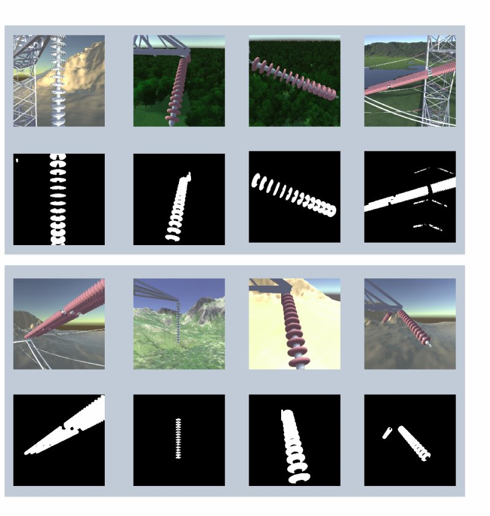
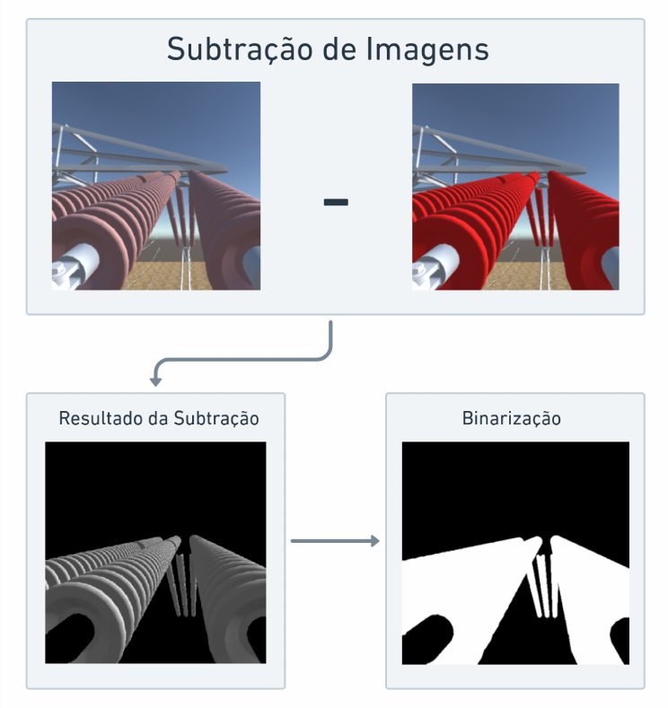
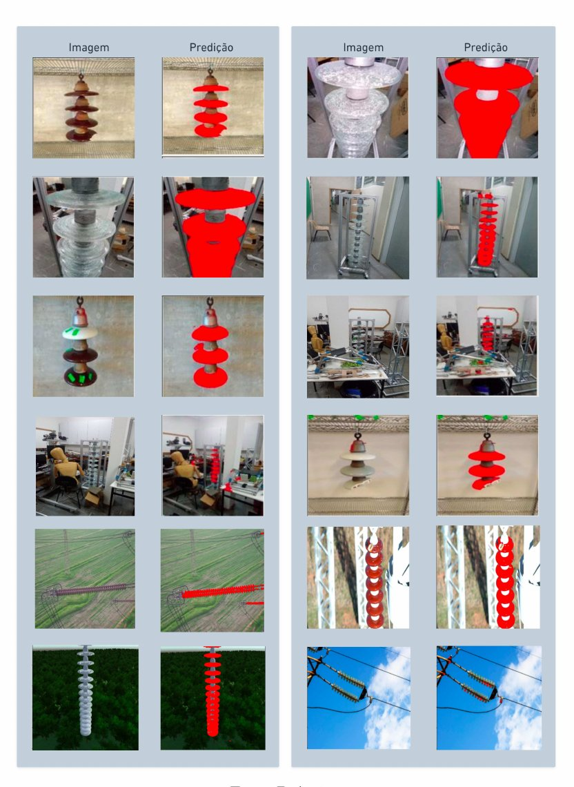
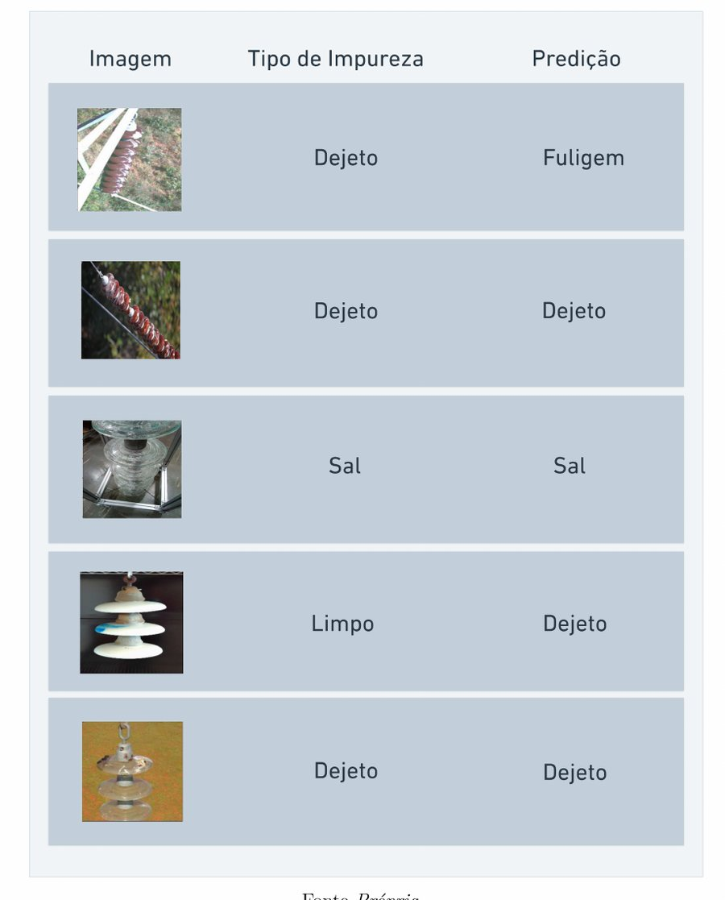

# auto-insulabelling

**Detecting when high-voltage insulator strings need cleaning, with deep learning trained only on synthetic images.**

B.Eng. thesis in Mechatronics Engineering, Federal University of Uberlândia (UFU), 2023.

## The problem

Insulator strings keep the high voltage in the cables from reaching the tower, and they only do that well while they are clean. Deciding whether a string needs washing is usually a visual inspection, done by people working close to live equipment. Automating it runs into a data problem: labeled photos of dirty insulators are scarce.

## Approach

Two stages, both trained only on synthetic images rendered in Unity 3D from models built in Autodesk Inventor:

1. **Find the insulator string** with semantic segmentation. Dataset: 47,286 images of glass, porcelain and polymer insulators across six landscapes (mountains, forest, desert, city, stream, farmland).
2. **Classify the contamination on the discs** as soot, salt, bird excrement or clean. Dataset: 14,432 images.

<p align="center">
  
  <br><em>Synthetic scenes and their masks.</em>
</p>

### Labels without manual annotation

Each scene is rendered twice: once with the discs in their real color and once painted red. Subtracting the two renders and binarizing the difference gives a pixel-accurate mask, so 47,286 images were labeled without drawing a single polygon.

The trick has a limit, and it shows up in the results: glass is transparent, so the red paint also tints what is behind the disc, and glass masks come out noisier than porcelain or polymer ones.

<p align="center">
  
  <br><em>Automatic mask generation: subtraction of two renders, then binarization.</em>
</p>

## Results

### Segmentation

Four combinations were trained: U-Net and LinkNet, each with VGG16 and ResNet-34 backbones. The best was **LinkNet with VGG16**. Dice coefficient:

| Insulator | Synthetic test set (843 images) | Real photos (50 images, annotated by hand) |
|---|---|---|
| Glass | 0.92 | 0.88 |
| Porcelain | 0.97 | 0.95 |
| Polymer | 0.96 | 0.92 |
| **Mean** | **0.95** | **0.92** |

The model never saw a real photo during training, so the right column measures how well the synthetic data transfers to the real world.

<p align="center">
  
  <br><em>Predictions on real photos (predicted string in red).</em>
</p>

### Contamination classification

Accuracy per class on a 300-image test set that mixes synthetic and real images:

| Model | Soot | Salt | Excrement | Clean | Mean | Training time |
|---|---|---|---|---|---|---|
| **Custom CNN (5 convolutional layers)** | 0.99 | 0.97 | 0.98 | 0.99 | **0.98** | 1 h 46 min |
| VGG16 (frozen ImageNet encoder) | 0.97 | 0.94 | 0.95 | 0.98 | 0.96 | 7 h 51 min |
| ResNet-34 (from scratch) | 0.87 | 0.86 | 0.88 | 0.89 | 0.88 | 6 h 10 min |

The smallest network was both the most accurate and the fastest to train.

Real photos are the weak point. In the sample below, 3 of 5 are right: one misses because the original photo has very low resolution, the other because of a bluish stain that never appears in the synthetic data.

<p align="center">
  
  <br><em>Real photos: true class (middle) and prediction (right). Dejeto = excrement, Fuligem = soot, Sal = salt, Limpo = clean.</em>
</p>

## Repository

| Path | What it does |
|---|---|
| `notebooks/train-insulator-segmentation.ipynb` | Trains U-Net and LinkNet with VGG16 and ResNet-34 backbones (`segmentation_models`, Keras) |
| `notebooks/train-dirty-classificator.ipynb` | Trains and evaluates the contamination classifiers and plots confusion matrices |

The notebooks are the final state of the 2023 experiments and are saved without outputs. Some values in them (epochs, batch size) differ from the setup reported in the thesis: 512 × 512 inputs, Adam with a learning rate of 0.001, 50 epochs, Jaccard loss for segmentation and categorical cross-entropy for classification. The InsuLabel annotation tool described in the thesis is not part of this repository.

## Datasets

Both datasets are public:

- **Archived release, cited by the papers:** [Synthetic High-Voltage Power Line Insulator Images](https://doi.org/10.5281/zenodo.11287111) on Zenodo, under CC BY 4.0, with the segmentation set (12 GB) and the classification set (4.6 GB).
- **Kaggle:** [insulator strings (segmentation)](https://www.kaggle.com/datasets/hericlesfelipe/insulator-dataset-simulated) and [insulator contamination (classification)](https://www.kaggle.com/datasets/hericlesfelipe/insulator-dirty-dataset-simulated).

The notebooks expect them next to the repository, in `../dataset_insulators/` and `../dataset_dirty_insulator/`. Each notebook's first cell describes the folder layout.

The datasets are described in:

- Ferraz, H. F. et al. [Synthetic images datasets of clean and dirty string insulators used in high-voltage power lines](https://doi.org/10.1007/s40430-024-05204-2). *Journal of the Brazilian Society of Mechanical Sciences and Engineering*, 46, 636, 2024.
- Bianchi, R. A. C., Ferraz, H. F. et al. [A synthetic high-voltage power line insulator images dataset](https://doi.org/10.1016/j.dib.2024.110688). *Data in Brief*, 55, 110688, 2024.

## Running

TensorFlow 2.11 needs Python 3.10 or older. The models were trained on an RTX 3050 laptop GPU.

```bash
python3.10 -m venv .venv
source .venv/bin/activate
pip install -r requirements.txt jupyterlab
jupyter lab notebooks/
```

## License

Code under the [MIT License](LICENSE). The datasets on Zenodo are under CC BY 4.0.
